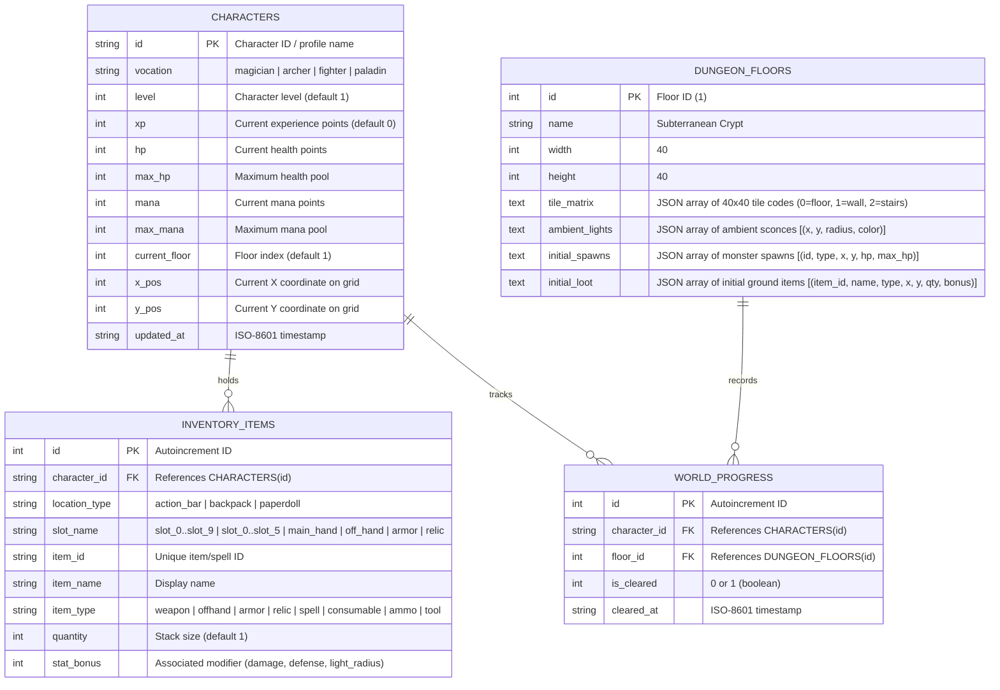
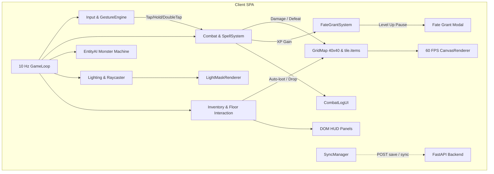
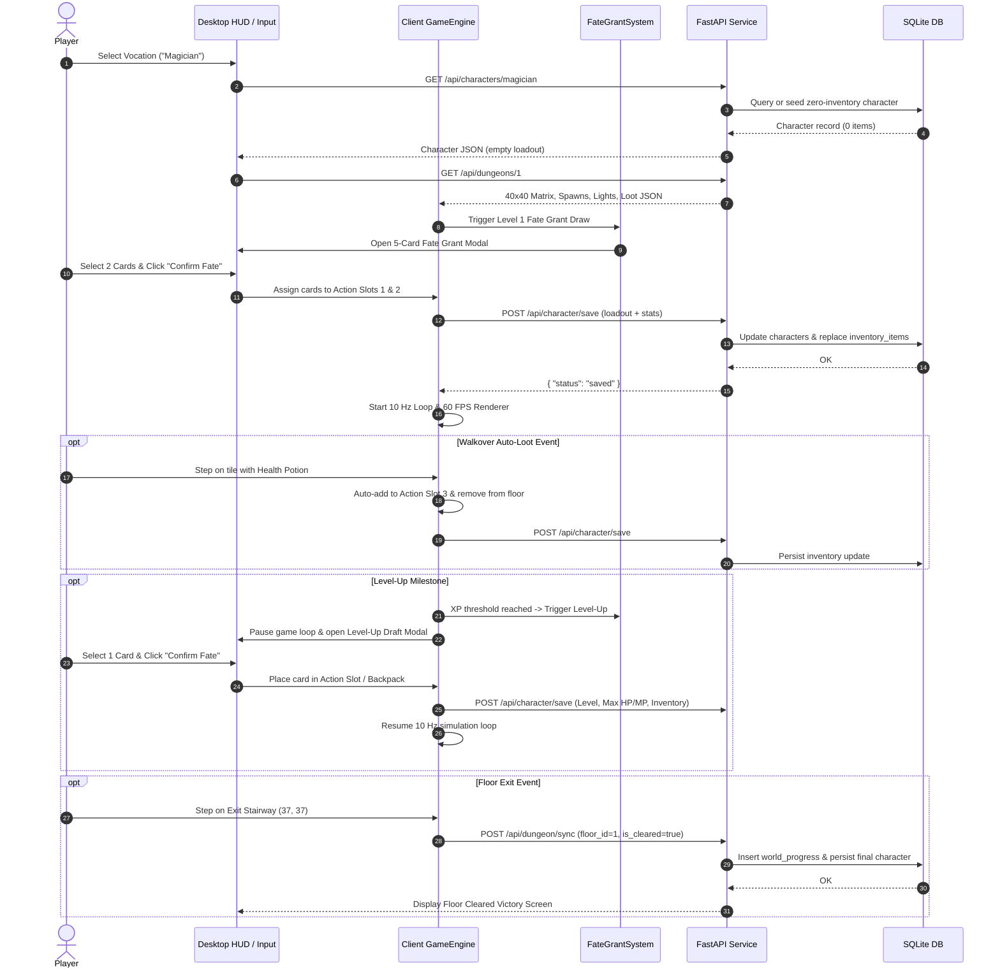

# Architecture Specification: Lokarta: Come Into The Light

## 1. Executive Overview & System Architecture

**Lokarta: Come Into The Light** is architected as a decoupled, client-authoritative 2D tile-based dungeon exploration RPG. The system is split into two primary tiers:
1. **Client SPA (TypeScript + Vite):** Runs the client-side game engine, executing a fixed 10 Hz (100ms) simulation tick loop, a 60 FPS Canvas rendering pipeline, discrete grid movement, dynamic raycasted line-of-sight (LOS) lighting with darkness masking, a multi-modal action activation engine (Tap, Hold/Charge, Double-Tap), a 10-slot Action Bar, 6-slot Backpack, 4-slot Paperdoll, zero-inventory start with Fate Grant roguelike drafting, tactical enemy AI, and DOM-based modular desktop HUD panels.
2. **Backend Service (FastAPI + SQLite via `aiosqlite`):** Provides RESTful endpoints for 40×40 subterranean crypt manifest distribution, initial character profile creation with zero baseline inventory, character state persistence (`/api/character/save`), and floor clearance synchronization (`/api/dungeon/sync`).

```text
┌─────────────────────────────────────────────────────────────────────────────────────────┐
│                                   BROWSER CLIENT (SPA)                                  │
│                                                                                         │
│  ┌───────────────────────────────────────────────────────────────────────────────────┐  │
│  │                                  Game Engine Core                                 │  │
│  │   - GameLoop (100ms / 10 Hz fixed tick)                                           │  │
│  │   - Grid & Collision Manager (40×40 matrix, 32×32 px tiles)                       │  │
│  │   - Lighting & Raycaster Engine (1-tile base, 5-torch, 7-spell, FoW mask)         │  │
│  │   - Multi-Modal Gesture Engine (Tap <250ms, Hold >=250ms, Double-Tap <300ms)      │  │
│  │   - Combat System (Magician, Archer, Fighter, Paladin abilities & projectiles)    │  │
│  │   - Fate Grant Roguelike Engine (Zero-inventory init, 5-card draft at Lvl 1 & up) │  │
│  │   - Entity & Tactical AI (Skeleton A* pathfinding, Cultist 3-4 tile standoff)     │  │
│  │   - Inventory Manager (10 Action Slots, 6 Backpack, 4 Paperdoll, tile.items stack)│  │
│  │   - Ground Interaction (Walkover auto-loot, direct pointer click, drop to floor)  │  │
│  │   - State & Sync Controller (REST dispatcher for saves and floor completion)      │  │
│  └─────────────────────────────────────────┬─────────────────────────────────────────┘  │
│                                            │                                            │
│        ┌───────────────────────────────────┴───────────────────────────────────┐        │
│        ▼                                                                       ▼        │
│  ┌─────────────────────────────────────────┐   ┌─────────────────────────────────────┐  │
│  │             Renderer (Canvas)           │   │            DOM / CSS HUD            │  │
│  │  - Tilemap & Prop Layers (32x32 tiles)  │   │  - 10 Action Slots (Keys 1-0)       │  │
│  │  - Character & Monster Sprites          │   │  - Charge Gauge & Cooldown Overlays │  │
│  │  - Darkness Mask (FoW alpha compositing)│   │  - 4-Slot Paperdoll Panel           │  │
│  │  - Particle Beams & Projectiles         │   │  - 6-Slot Backpack Grid             │  │
│  │  - Ground Item Stacks                   │   │  - Resource Bars (HP, Mana, XP)     │  │
│  └─────────────────────────────────────────┘   │  - Fate Grant 5-Card Draft Modal    │  │
│                                                │  - Scrolling Combat & Event Log     │  │
│                                                └─────────────────────────────────────┘  │
└────────────────────────────────────────────┬────────────────────────────────────────────┘
                                             │ HTTP / REST (JSON)
                                             │ (CORS: localhost:5173 -> localhost:8000)
                                             ▼
┌─────────────────────────────────────────────────────────────────────────────────────────┐
│                                BACKEND SERVICE (FastAPI)                                │
│                                                                                         │
│  ┌───────────────────────────────────────────────────────────────────────────────────┐  │
│  │                                    API Routes                                     │  │
│  │   - GET  /api/dungeons/{id}      -> Crypt matrix, sconces, spawns, initial loot   │  │
│  │   - GET  /api/characters/{id}    -> Character stats, vocation, saved loadout      │  │
│  │   - POST /api/character/save     -> Commit full character progression & inventory │  │
│  │   - POST /api/dungeon/sync       -> Commit floor clear state & final snapshot     │  │
│  └─────────────────────────────────────────┬─────────────────────────────────────────┘  │
│                                            │                                            │
│                                            ▼                                            │
│  ┌───────────────────────────────────────────────────────────────────────────────────┐  │
│  │                         Storage Layer (aiosqlite / SQLite)                        │  │
│  │   - characters: Vocation, Level, XP, HP, Max HP, Mana, Max Mana, Position         │  │
│  │   - inventory_items: 10 action slots, 6 backpack slots, 4 paperdoll slots         │  │
│  │   - dungeon_floors: Seeded 40×40 layout definitions, lights, spawns, loot         │  │
│  │   - world_progress: Session floor clearance and persistence records               │  │
│  └───────────────────────────────────────────────────────────────────────────────────┘  │
└─────────────────────────────────────────────────────────────────────────────────────────┘
```

---

## 2. Project Directory & File Structure

```text
lokarta-v2.1/
├── backend/
│   ├── __init__.py
│   ├── main.py                  # FastAPI application entrypoint and CORS configuration
│   ├── database.py              # SQLite connection lifecycle, aiosqlite setup, DDL init
│   ├── models/
│   │   ├── __init__.py
│   │   ├── character.py         # Pydantic schemas for 4 vocations, stats, level, XP
│   │   ├── dungeon.py           # Pydantic schemas for 40x40 dungeon matrix & spawns
│   │   └── inventory.py         # Pydantic schemas for action bar, backpack, paperdoll
│   ├── routers/
│   │   ├── __init__.py
│   │   ├── characters.py        # /api/characters/* endpoints
│   │   └── dungeons.py          # /api/dungeons/* endpoints
│   ├── services/
│   │   ├── __init__.py
│   │   ├── character_service.py # Character retrieval, zero-inventory init, saving
│   │   └── dungeon_service.py   # Dungeon layout generation, floor clear tracking
│   └── seed_data/
│       ├── __init__.py
│       └── crypt_floor_1.py     # 40x40 crypt matrix, monster spawns, sconces, ground loot
├── frontend/
│   ├── index.html               # SPA root HTML with modular desktop layout container
│   ├── package.json             # Vite and TypeScript frontend configuration
│   ├── tsconfig.json
│   ├── vite.config.ts           # Dev server config (port 5173, API proxying)
│   ├── src/
│   │   ├── main.ts              # Client entrypoint and lifecycle orchestrator
│   │   ├── config.ts            # Constants (grid size 32, tick 100ms, API URLs, timings)
│   │   ├── types/
│   │   │   ├── api.ts           # Backend DTO interfaces matching Pydantic schemas
│   │   │   ├── entity.ts        # Player, Monster, Stats, Coordinates, Vocation types
│   │   │   ├── item.ts          # Item, ItemType, Rarity, ContainerSlot, PaperdollSlot
│   │   │   ├── fate.ts          # FateCard, DraftState, CardOffer interfaces
│   │   │   ├── action.ts        # ActionSlot, GestureType (Tap, Hold, DoubleTap), Cooldown
│   │   │   └── world.ts         # Tile, DungeonFloor, LightEmitter, Raycast types
│   │   ├── engine/
│   │   │   ├── GameEngine.ts    # Central coordinator & 100ms fixed tick loop
│   │   │   ├── GridMap.ts       # 40x40 spatial collision and ground stack matrix
│   │   │   ├── LightingSystem.ts# Bresenham/raycast LOS and dynamic light radius
│   │   │   ├── GestureEngine.ts # Multi-modal input classifier (Tap, Hold, Double-Tap)
│   │   │   ├── CombatSystem.ts  # Damage calculation, cooldowns, projectile travel
│   │   │   ├── FateGrantSystem.ts # 5-card draft generation, weighting, level progression
│   │   │   ├── EntityAI.ts      # Skeleton A* pathfinding and Cultist standoff state machine
│   │   │   ├── InventorySystem.ts # 10 Action slots, 6 Backpack, 4 Paperdoll, ground stacks
│   │   │   └── SyncManager.ts   # REST state saver and floor clear dispatcher
│   │   ├── render/
│   │   │   ├── CanvasRenderer.ts# Oblique 2D canvas viewport renderer (32x32 tiles)
│   │   │   ├── LightMaskRenderer.ts # Radial fog-of-war alpha compositing
│   │   │   └── SpriteManager.ts # Tile, character, monster, item, and VFX sprites
│   │   └── ui/
│   │       ├── CharacterSelect.ts # Vocation selection modal (4 vocations)
│   │       ├── FateGrantModal.ts  # 5-card roguelike draft overlay (select 1-2)
│   │       ├── ActionSlotBarUI.ts # 10-slot modular hotbar with charge and cooldown meters
│   │       ├── PaperdollUI.ts     # 4-slot equipment panel (Main, Off, Armor, Relic)
│   │       ├── BackpackUI.ts      # 6-slot inventory container panel
│   │       ├── StatusBarsUI.ts    # Health (HP), Mana (MP), XP gauges and Vocation badge
│   │       └── CombatLogUI.ts     # Scrolling event and combat text log
│   └── styles/
│       ├── main.css             # Desktop shell framing, typography, layout
│       └── panels.css           # Modular HUD styling (hotbar, paperdoll, backpack, modal)
├── docs/
│   ├── architecture.md          # Technical architecture specification (this document)
│   └── verification-report.md   # Stage 8 verification output
├── summaries/
│   ├── 00-template.md
│   └── 05-architecture.md       # Stage 5 architectural summary
├── requirements.txt
├── install.sh
├── run.sh
├── environment-notes.md
└── concept.md
```

---

## 3. Data Models & SQLite Database Schema

The persistence layer uses a local SQLite database (`backend/lokarta.db`) managed asynchronously via `aiosqlite`.



### 3.1 SQLite DDL Table Definitions

```sql
CREATE TABLE IF NOT EXISTS characters (
    id TEXT PRIMARY KEY,
    vocation TEXT NOT NULL CHECK(vocation IN ('magician', 'archer', 'fighter', 'paladin')),
    level INTEGER NOT NULL DEFAULT 1,
    xp INTEGER NOT NULL DEFAULT 0,
    hp INTEGER NOT NULL,
    max_hp INTEGER NOT NULL,
    mana INTEGER NOT NULL,
    max_mana INTEGER NOT NULL,
    current_floor INTEGER NOT NULL DEFAULT 1,
    x_pos INTEGER NOT NULL,
    y_pos INTEGER NOT NULL,
    updated_at TEXT NOT NULL
);

CREATE TABLE IF NOT EXISTS inventory_items (
    id INTEGER PRIMARY KEY AUTOINCREMENT,
    character_id TEXT NOT NULL,
    location_type TEXT NOT NULL CHECK(location_type IN ('action_bar', 'backpack', 'paperdoll')),
    slot_name TEXT NOT NULL,
    item_id TEXT NOT NULL,
    item_name TEXT NOT NULL,
    item_type TEXT NOT NULL CHECK(item_type IN ('weapon', 'offhand', 'armor', 'relic', 'spell', 'consumable', 'ammo', 'tool')),
    quantity INTEGER NOT NULL DEFAULT 1,
    stat_bonus INTEGER NOT NULL DEFAULT 0,
    FOREIGN KEY(character_id) REFERENCES characters(id) ON DELETE CASCADE
);

CREATE TABLE IF NOT EXISTS dungeon_floors (
    id INTEGER PRIMARY KEY,
    name TEXT NOT NULL,
    width INTEGER NOT NULL DEFAULT 40,
    height INTEGER NOT NULL DEFAULT 40,
    tile_matrix TEXT NOT NULL,
    ambient_lights TEXT NOT NULL,
    initial_spawns TEXT NOT NULL,
    initial_loot TEXT NOT NULL
);

CREATE TABLE IF NOT EXISTS world_progress (
    id INTEGER PRIMARY KEY AUTOINCREMENT,
    character_id TEXT NOT NULL,
    floor_id INTEGER NOT NULL,
    is_cleared INTEGER NOT NULL DEFAULT 0,
    cleared_at TEXT,
    FOREIGN KEY(character_id) REFERENCES characters(id) ON DELETE CASCADE,
    FOREIGN KEY(floor_id) REFERENCES dungeon_floors(id)
);

CREATE INDEX IF NOT EXISTS idx_inventory_char ON inventory_items(character_id);
CREATE INDEX IF NOT EXISTS idx_progress_char ON world_progress(character_id);
```

---

## 4. REST API Contracts

All API endpoints return JSON payloads and adhere strictly to Pydantic v2 schemas.

### 4.1 `GET /api/dungeons/{id}`
Retrieves the 40×40 subterranean crypt floor layout, static lights, monster spawns, and initial floor loot.

- **Method:** `GET`
- **Path Parameter:** `id: int` (e.g. `1`)
- **Response Status:** `200 OK`
- **Response Schema:**
```json
{
  "id": 1,
  "name": "Subterranean Crypt - Floor 1",
  "width": 40,
  "height": 40,
  "entrance": { "x": 2, "y": 2 },
  "exit": { "x": 37, "y": 37 },
  "tile_matrix": [
    [1, 1, 1, 1, "... 40 values per row ..."],
    [1, 0, 0, 0, "... 0=walkable floor, 1=stone wall, 2=exit stairs ..."],
    ["... 40 rows total ..."]
  ],
  "ambient_lights": [
    { "x": 2, "y": 2, "radius": 4, "color": "#ffaa44" },
    { "x": 10, "y": 10, "radius": 3, "color": "#ffaa44" },
    { "x": 25, "y": 18, "radius": 3, "color": "#ffaa44" },
    { "x": 37, "y": 37, "radius": 4, "color": "#88eeff" }
  ],
  "spawns": [
    { "id": "skel_1", "type": "crypt_skeleton", "x": 8, "y": 12, "hp": 40, "max_hp": 40 },
    { "id": "skel_2", "type": "crypt_skeleton", "x": 19, "y": 14, "hp": 40, "max_hp": 40 },
    { "id": "cult_1", "type": "shadow_cultist", "x": 28, "y": 24, "hp": 30, "max_hp": 30 }
  ],
  "initial_loot": [
    { "item_id": "health_potion", "name": "Health Potion", "type": "consumable", "x": 5, "y": 4, "quantity": 1, "stat_bonus": 30 },
    { "item_id": "torch", "name": "Wooden Torch", "type": "tool", "x": 3, "y": 2, "quantity": 1, "stat_bonus": 5 },
    { "item_id": "arrows", "name": "Arrows", "type": "ammo", "x": 12, "y": 8, "quantity": 15, "stat_bonus": 0 }
  ]
}
```

### 4.2 `GET /api/characters/{id}`
Retrieves a character profile. For newly created characters, returns zero starting inventory items in `action_bar`, `backpack`, and `paperdoll`, enabling the Level 1 Fate Grant sequence upon entering the dungeon.

- **Method:** `GET`
- **Path Parameter:** `id: str` (`magician`, `archer`, `fighter`, `paladin`, or custom player profile name)
- **Response Status:** `200 OK`
- **Response Schema:**
```json
{
  "id": "magician",
  "vocation": "magician",
  "level": 1,
  "xp": 0,
  "hp": 60,
  "max_hp": 60,
  "mana": 150,
  "max_mana": 150,
  "current_floor": 1,
  "position": { "x": 2, "y": 2 },
  "action_bar": [],
  "backpack": [],
  "paperdoll": {
    "main_hand": null,
    "off_hand": null,
    "armor": null,
    "relic": null
  }
}
```

### 4.3 `POST /api/character/save`
Dispatched upon Fate Grant confirmation, item pickups/drops, level ups, and major gameplay state changes.

- **Method:** `POST`
- **Request Headers:** `Content-Type: application/json`
- **Request Body:**
```json
{
  "id": "magician",
  "vocation": "magician",
  "level": 2,
  "xp": 120,
  "hp": 65,
  "max_hp": 70,
  "mana": 140,
  "max_mana": 170,
  "current_floor": 1,
  "position": { "x": 14, "y": 18 },
  "action_bar": [
    {
      "slot_index": 0,
      "item_id": "apprentice_wand",
      "name": "Apprentice Wand",
      "type": "weapon",
      "quantity": 1,
      "stat_bonus": 12
    },
    {
      "slot_index": 1,
      "item_id": "spell_light",
      "name": "Light Spell",
      "type": "spell",
      "quantity": 1,
      "stat_bonus": 7
    },
    {
      "slot_index": 2,
      "item_id": "health_potion",
      "name": "Health Potion",
      "type": "consumable",
      "quantity": 2,
      "stat_bonus": 30
    }
  ],
  "backpack": [
    {
      "slot_index": 0,
      "item_id": "mana_potion",
      "name": "Mana Potion",
      "type": "consumable",
      "quantity": 2,
      "stat_bonus": 40
    }
  ],
  "paperdoll": {
    "main_hand": {
      "item_id": "apprentice_wand",
      "name": "Apprentice Wand",
      "type": "weapon",
      "quantity": 1,
      "stat_bonus": 12
    },
    "off_hand": {
      "item_id": "torch",
      "name": "Wooden Torch",
      "type": "tool",
      "quantity": 1,
      "stat_bonus": 5
    },
    "armor": {
      "item_id": "cloth_robe",
      "name": "Cloth Robe",
      "type": "armor",
      "quantity": 1,
      "stat_bonus": 2
    },
    "relic": null
  }
}
```
- **Response Status:** `200 OK`
- **Response Body:** `{ "status": "saved", "character_id": "magician", "timestamp": "2026-09-10T05:30:00Z" }`

### 4.4 `POST /api/dungeon/sync`
Dispatched when the player navigates onto the exit stairway tile `(37, 37)`.

- **Method:** `POST`
- **Request Body:**
```json
{
  "character_id": "magician",
  "floor_id": 1,
  "is_cleared": true,
  "character_state": {
    "level": 2,
    "xp": 180,
    "hp": 65,
    "max_hp": 70,
    "mana": 140,
    "max_mana": 170,
    "current_floor": 1,
    "position": { "x": 37, "y": 37 }
  }
}
```
- **Response Status:** `200 OK`
- **Response Body:**
```json
{
  "status": "floor_cleared",
  "character_id": "magician",
  "floor_id": 1,
  "cleared": true,
  "message": "Floor 1 cleared successfully."
}
```

---

## 5. Playable Vocations & Combat Archetypes

| Vocation | Base HP | Base Mana | Combat Archetype | Core Starter Abilities & Spells |
| :--- | :--- | :--- | :--- | :--- |
| **Magician** | 60 | 150 | Glass-cannon ranged caster & illuminator | *Wand Spark* (Ranged spark), *Light* (+3 FOV radius for 30s), *Energy Beam* (4-tile piercing line strike) |
| **Archer** | 90 | 80 | Long-range physical sniper | *Bow Shot* (LOS ranged, uses Arrows), *Power Shot* (Heavy physical burst) |
| **Fighter** | 140 | 30 | High-durability close-quarters bruiser | *Slash* (Adjacent melee strike), *Cleave* (3-tile frontal arc swing), *Iron Guard* (Defensive physical barrier) |
| **Paladin** | 120 | 90 | Holy hybrid defender & healer | *Holy Strike* (Crushing warhammer melee), *Healing Prayer* (Restores HP), *Aegis* (Holy protection shield) |

### 5.1 Level-Up Attribute Progression Formula
Upon accumulating threshold XP:
- $\text{Threshold XP}(L) = 100 \times L$
- **Magician:** $+10\text{ Max HP}$, $+20\text{ Max Mana}$ per level.
- **Archer:** $+15\text{ Max HP}$, $+10\text{ Max Mana}$ per level.
- **Fighter:** $+25\text{ Max HP}$, $+5\text{ Max Mana}$ per level.
- **Paladin:** $+20\text{ Max HP}$, $+15\text{ Max Mana}$ per level.

---

## 6. Modular Action Slots & Multi-Modal Gesture Engine

The player controls combat and utility through **10 Action Slots** bound to hotkeys `1`, `2`, `3`, `4`, `5`, `6`, `7`, `8`, `9`, `0`, as well as direct mouse pointer interactions.

```text
       ┌─────────── Keydown / PointerDown ───────────┐
       │                                             │
       ▼                                             ▼
  Hold < 250ms                                  Hold >= 250ms
       │                                             │
Keyup / PointerUp                              Fills visual Charge Gauge
       │                                             │
Check for 2nd Press within 300ms               Keyup / PointerUp
 ┌─────┴─────┐                                       │
 ▼           ▼                                       ▼
[TAP]   [DOUBLE-TAP]                          [HOLD / CHARGED]
Primary   Secondary / Combo                   Overcharged / Heavy
```

### 6.1 Input Timing Thresholds
- **Tap:** Key/button release occurs in $< 250\text{ ms}$. Fires the immediate primary action.
- **Hold / Charge:** Key/button held for $\ge 250\text{ ms}$ (up to $1500\text{ ms}$ max charge). Fills the circular/radial charge meter on the slot icon. Releasing discharges the powered-up variant. Releasing $< 250\text{ ms}$ defaults to a normal tap.
- **Double-Tap:** A second press occurs within $< 300\text{ ms}$ of the initial release. Triggers rapid combo or secondary utility.

### 6.2 Multi-Modal Ability Matrix

| Slot Content | Tap (<250ms) | Hold / Charge (>=250ms) | Double-Tap (<300ms) | Resource Cost | Cooldown |
| :--- | :--- | :--- | :--- | :--- | :--- |
| **Wand Spark** (Magician) | Basic Spark (12–16 Magic Dmg) | Overcharged Orb (24–32 Magic Dmg + 1-tile splash) | Rapid Twin Sparks (2× 10 Dmg) | 0 Mana (Tap) / 10 Mana (Hold) | 1.0s / 2.5s |
| **Light Spell** (Magician) | Illumination Aura (+3 FOV radius for 30s) | Radiant Flare (+5 FOV radius for 15s + blinds enemies 2s) | Instant Recast / Cancel Aura | 15 Mana / 25 Mana | 5.0s / 10.0s |
| **Energy Beam** (Magician) | 4-tile piercing line (30–40 Dmg) | 6-tile Mega Beam (55–70 Dmg) | Quick 2-tile Short Burst (20 Dmg) | 30 Mana / 50 Mana | 3.0s / 6.0s |
| **Bow Shot** (Archer) | Quick Shot (14–18 Phys Dmg) | Snipe Shot (35–45 Phys Dmg, bypasses 50% armor) | Double Arrow Shot (2× 12 Dmg) | 1 Arrow (Tap/Hold) / 2 Arrows (Double) | 1.0s / 3.0s |
| **Power Shot** (Archer) | Piercing Arrow (32–42 Phys Dmg) | Ballistic Volley (Pierces 3 enemies in a line) | Point-Blank Concussive Blast (Knocks back 1 tile) | 1 Arrow, 15 Focus | 4.0s / 6.0s |
| **Shortsword** (Fighter) | Quick Slash (16–20 Phys Dmg) | Heavy Thrust (30–38 Phys Dmg) | Flurry (2× 12 Phys Dmg) | 0 Mana | 0.8s / 2.0s |
| **Cleave** (Fighter) | 3-tile Frontal Arc (22–28 Dmg) | Whirling Cleave (All 8 adjacent tiles for 35 Dmg) | Step-In Cleave (Advance 1 tile & Cleave) | 10 Mana | 2.5s / 5.0s |
| **Warhammer** (Paladin) | Holy Strike (18–24 Holy Dmg) | Smite of Judgment (38–48 Holy Dmg) | Consecrated Double Strike (2× 14 Dmg) | 10 Mana / 25 Mana | 1.2s / 3.0s |
| **Healing Prayer** (Paladin) | Self-Heal (+35 HP) | Radiant Aura (Heals +60 HP + cures debuffs) | Quick Infusion (+20 HP instant) | 20 Mana / 40 Mana | 4.0s / 8.0s |
| **Health Potion** | Drink (+30 HP) | Concentrated Sip (+45 HP over 3s) | Chug 2× Potions (+60 HP) | 1 Potion (or 2) | 1.5s |
| **Mana Potion** | Drink (+40 MP) | Concentrated Sip (+60 MP over 3s) | Chug 2× Potions (+80 MP) | 1 Potion (or 2) | 1.5s |

---

## 7. Zero-Inventory Baseline & Fate Grant Roguelike Progression

```text
 [Start Level 1] ───► [Empty Inventory] ───► [Open 5-Card Fate Grant Modal]
                                                        │
 ┌──────────────────────────────────────────────────────┘
 │ Select 1 or 2 Cards -> "Confirm Fate"
 ▼
 [Populate Action Slots 1 & 2] ───► [Resume Exploration & 10 Hz Loop]
                                                        │
 ┌──────────────────────────────────────────────────────┘
 │ Defeat Monsters -> Gain XP -> Level Up Reached
 ▼
 [Pause Loop] ───► [Open Level-Up Fate Grant Modal (Upgraded Cards)]
                         │
                         ▼
        Select 1 or 2 Cards -> "Confirm Fate"
                         │
       ┌─────────────────┴─────────────────┐
       ▼                                   ▼
 [Lowest Empty Action Slot (1-10)]   [Backpack (1-6)]
       │ (if full)                         │ (if full)
       └─────────────────► ┌───────────────┘
                           ▼
                 [Drop to Current Floor (tile.items)]
```

### 7.1 Draft Mechanics
1. **Level 1 Creation Draft:**
   - 5 distinct cards drawn from the card catalog.
   - Guaranteed minimum 2 vocation-aligned starter weapons/spells (e.g., Magician gets Apprentice Wand & Light Spell; Archer gets Hunting Bow & Arrows; Fighter gets Shortsword & Cleave; Paladin gets Warhammer & Healing Prayer).
   - Player selects 1 or 2 cards and confirms.
2. **Level-Up Milestones:**
   - On reaching Level 2, 3, etc., game simulation pauses and opens the Fate Grant modal.
   - 5 cards drawn across rarity tiers: Common (50%), Rare (30%), Epic (15%), Legendary (5%).
   - Offerings include upgraded weapons, spells, passive relics, armor, and potion bundles.
3. **Inventory Overflow Rules:**
   - Cards selected from drafts automatically fill the lowest empty **Action Slot (1–10)**.
   - If all 10 Action Slots are occupied, cards fill the lowest empty **Backpack slot (1–6)**.
   - If both Action Slots and Backpack are full, surplus items drop directly onto the player's current floor tile (`tile.items`).

---

## 8. Frictionless Floor Interaction & Tactile Item Stacks

### 8.1 Ground Tile Item Stacks (`tile.items`)
Every tile on the 40×40 grid maintains an array of items: `tile.items: Item[]`.
- Items physically render on the 32×32 pixel canvas tile with top-item rendering priority.

### 8.2 Frictionless Interaction Rules
- **Walkover Auto-Loot:** When the player character steps onto any coordinate `(x, y)` with `tile.items.length > 0`, the items are automatically picked up in order:
  1. Routed to lowest empty Action Slot `0..9`.
  2. Routed to lowest empty Backpack slot `0..5`.
  3. If all slots are full, items remain on the floor with a HUD log notification: *"Inventory full! Could not pick up [Item Name]"*.
- **Direct Pointer Clicks:** Clicking directly with the mouse pointer on an item stack on the player's tile or an adjacent tile picks it up immediately.
- **Dropping Items:** Dragging an item from the Action Bar or Backpack and dropping it onto a walkable viewport tile removes it from inventory and pushes it to that tile's `tile.items` stack.
- **Direct Consumable Use:** Consumables can be activated directly from Action Slots (Hotkeys 1–0 / Click), Backpack slots, or by right-clicking ground items.
- **Legacy Keys:** No `[E]` (pickup) or `[U]` (use) keys are used.

---

## 9. Subsystem Architecture & Client Engine



### 9.1 Dynamic Lighting & Raycast Line of Sight
- **Baseline Sight:** 1-tile adjacent radius in pitch darkness.
- **Equipped Torch:** 5-tile radius light circle when equipped in `paperdoll.off_hand` or held in active action slot.
- **Magician Light Spell:** Expands player vision to 7-tile radius for 30.0 seconds.
- **Ambient Sconces & Stairs:** Static emitters casting 3-to-4 tile radius light circles.
- **Bresenham Raycasting:** Radiates rays from all active light origins. Opaque stone walls (`1`) stop light rays from propagating behind them, casting shadows into unrevealed rooms.
- **Entity Concealment:** Monsters and ground items in unlit tiles do not render and cannot be targeted.

### 9.2 Tactical Monster AI
- **Crypt Skeleton (Melee):** Awakens when illuminated. Uses A* pathfinding to pursue the player. Attacks every 1.5s when at distance = 1.
- **Shadow Cultist (Ranged):** Awakens when illuminated. Maintains a 3-to-4 tile standoff distance. Channels and fires *Shadow Bolt* projectiles every 2.0s when line-of-sight is unobstructed.
- **Death & Loot Drops:** Defeated monsters spawn their rolled loot directly onto their death coordinate `tile.items` and award XP to the player.

---

## 10. Modular Desktop Interface Layout Contract

```text
┌─────────────────────────────────────────────────────────────────────────────────────────┐
│                                   LOKARTA DESKTOP SHELL                                 │
├───────────────────────────────────────────────────┬─────────────────────────────────────┤
│                                                   │  CHARACTER STATUS                   │
│                                                   │  Vocation: Magician   Level: 1      │
│                                                   │  HP:   [████████████████] 60 / 60   │
│                                                   │  MANA: [████████████████] 150 / 150 │
│                                                   │  XP:   [████░░░░░░░░░░░░] 40 / 100  │
│                                                   ├─────────────────────────────────────┤
│                                                   │  EQUIPMENT (PAPERDOLL)              │
│                                                   │  ┌─────────┐ ┌─────────┐            │
│                                                   │  │ Main H. │ │ Armor   │            │
│                                                   │  │ [Wand]  │ │ [Robe]  │            │
│                                                   │  ├─────────┤ ├─────────┤            │
│                                                   │  │ Off H.  │ │ Relic   │            │
│                                                   │  │ [Torch] │ │ [Empty] │            │
│                                                   │  └─────────┘ └─────────┘            │
│                 VIEWPORT CANVAS                   ├─────────────────────────────────────┤
│                  (40×40 Grid)                     │  BACKPACK (6 SLOTS)                 │
│                                                   │  ┌───┐ ┌───┐ ┌───┐                  │
│                                                   │  │ 1 │ │ 2 │ │ 3 │                  │
│                                                   │  ├───┤ ├───┤ ├───┤                  │
│                                                   │  │ 4 │ │ 5 │ │ 6 │                  │
│                                                   │  └───┘ └───┘ └───┘                  │
├───────────────────────────────────────────────────┴─────────────────────────────────────┤
│  ACTION SLOTS (10 HOTKEYS: 1 - 0)                                                       │
│  ┌───┐ ┌───┐ ┌───┐ ┌───┐ ┌───┐ ┌───┐ ┌───┐ ┌───┐ ┌───┐ ┌───┐                           │
│  │ 1 │ │ 2 │ │ 3 │ │ 4 │ │ 5 │ │ 6 │ │ 7 │ │ 8 │ │ 9 │ │ 0 │  [Charge & Cooldown Meters]│
│  └───┘ └───┘ └───┘ └───┘ └───┘ └───┘ └───┘ └───┘ └───┘ └───┘                           │
├─────────────────────────────────────────────────────────────────────────────────────────┤
│  COMBAT & EVENT LOG                                                                     │
│  [10:30:01] Welcome to Lokarta: Come Into The Light. Vocation: Magician.                │
│  [10:30:02] Fate Grant: You drafted Apprentice Wand and Light Spell.                    │
│  [10:30:05] Walked over Health Potion - Added to Action Slot 3.                         │
│  [10:30:08] You hit Crypt Skeleton with Wand Spark for 14 damage. (Hold for Charge)     │
└─────────────────────────────────────────────────────────────────────────────────────────┘
```

---

## 11. State Persistence Lifecycle Sequence



---

## 12. Verification & Acceptance Criteria

1. **Boot & Database Initialization:** FastAPI boots and initializes SQLite schema with `characters`, `inventory_items`, `dungeon_floors`, and `world_progress`.
2. **4-Vocation Selection:** Player can initialize as Magician (60 HP, 150 MP), Archer (90 HP, 80 MP), Fighter (140 HP, 30 MP), or Paladin (120 HP, 90 MP).
3. **Zero-Inventory & Level 1 Fate Grant:** New character spawns with empty action slots, backpack, and paperdoll; spawning triggers the 5-card draft modal with at least 2 vocation starter items; selecting 1–2 cards populates Action Slots 1 and 2.
4. **10-Slot Modular Action Bar & Multi-Modal Gestures:**
   - Keys `1`–`0` activate corresponding slots.
   - Quick tap (<250ms) fires standard action.
   - Hold (≥250ms) fills visual charge gauge and discharges charged action on release.
   - Double-tap (<300ms) fires secondary combo.
   - Visual cooldown sweeps count down accurately.
5. **Walkover Auto-Loot & Pointer Interactions:** Stepping over ground items automatically transfers them to the lowest open Action Slot (1–10) then Backpack (1–6); left-clicking adjacent floor items loots them directly without legacy keys.
6. **Dynamic Lighting & Monsters:** Baseline 1-tile sight; torches give 5-tile radius; Magician *Light* gives 7-tile radius for 30s; Crypt Skeletons and Shadow Cultists aggro when illuminated and execute tactical behaviors.
7. **Progression & Persistence:** Defeating enemies awards XP; level-up increases max stats and triggers upgraded 5-card Fate Grant drafts; all state commits reliably to `POST /api/character/save` and `POST /api/dungeon/sync`.
