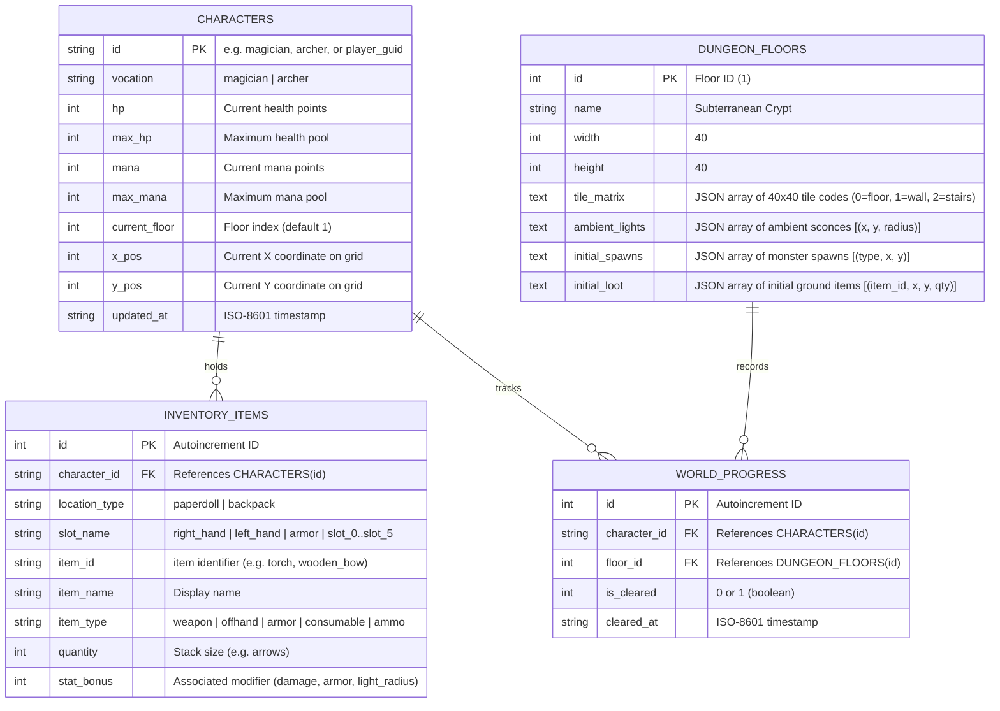
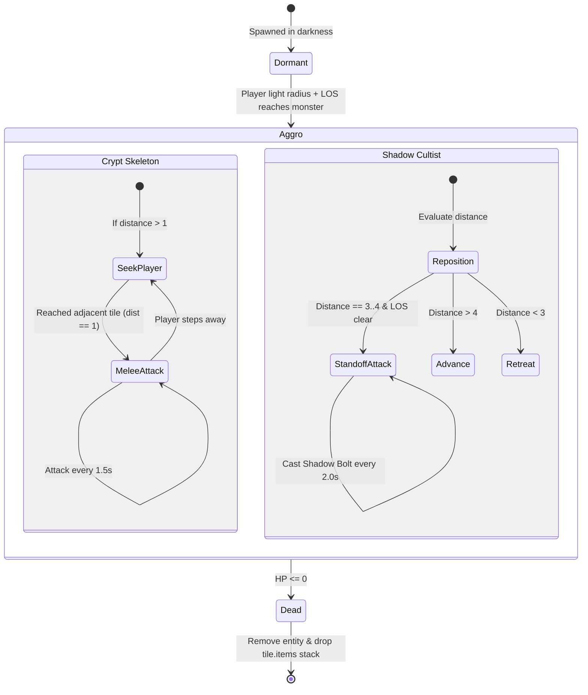
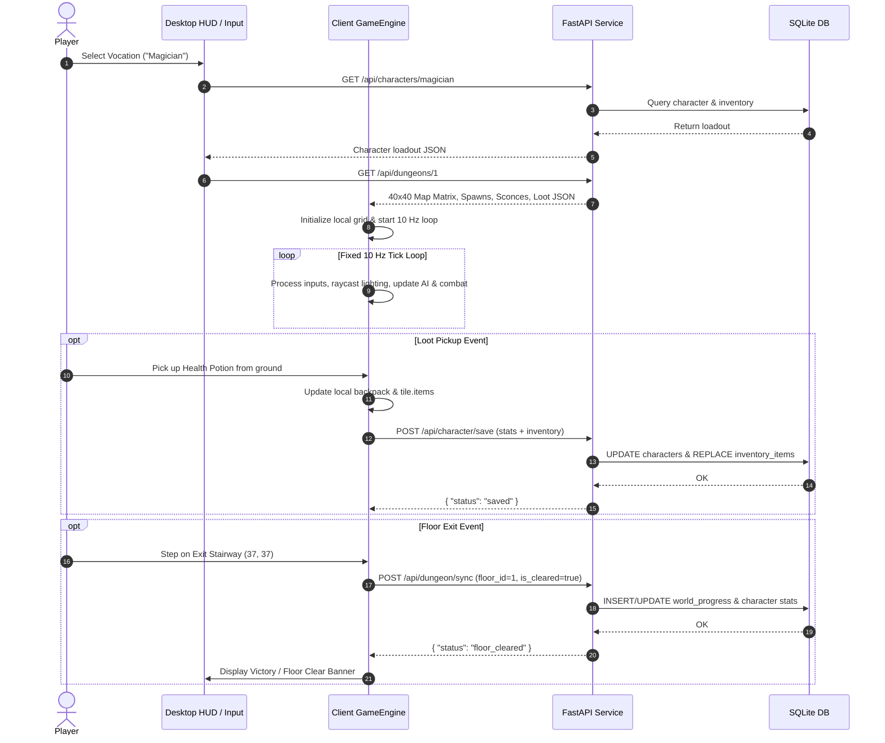

# Architecture Specification: Lokarta: Come Into The Light

## 1. Executive Overview & System Architecture

**Lokarta: Come Into The Light** is architected as a decoupled, client-authoritative 2D tile-based dungeon RPG. The system is split into two primary tiers:
1. **Client SPA (TypeScript + Vite):** Runs the client-side game engine, executing a fixed 10 Hz simulation tick loop, 60 FPS Canvas rendering, discrete grid movement, raycasted dynamic lighting and line-of-sight (LOS) occlusion, tactical enemy AI, inventory/ground interaction, and DOM-based HUD panels.
2. **Backend Service (FastAPI + SQLite):** Provides RESTful service endpoints for dungeon floor manifest distribution, default character profile seeding, and persistent game state synchronization across browser reloads.

```text
┌─────────────────────────────────────────────────────────────────────────────┐
│                             BROWSER CLIENT (SPA)                           │
│                                                                             │
│  ┌───────────────────────────────────────────────────────────────────────┐  │
│  │                            Game Engine Core                           │  │
│  │   - GameLoop (100ms / 10 Hz fixed tick)                               │  │
│  │   - Grid & Collision Manager (40×40 matrix, 32×32 px tiles)           │  │
│  │   - Lighting & Raycaster Engine (1-tile base, 5-torch, 7-spell, FoW)  │  │
│  │   - Combat & Spell System (Wand Spark, Energy Beam, Bow, Power Shot)  │  │
│  │   - Entity & Tactical AI Controller (Skeleton A*, Cultist Standoff)   │  │
│  │   - Inventory & Equipment Manager (6 Backpack, 3 Paperdoll, Ground)   │  │
│  │   - State & Sync Controller (REST dispatcher for saves/sync)          │  │
│  └───────────────────────────────────┬───────────────────────────────────┘  │
│                                      │                                      │
│        ┌─────────────────────────────┴─────────────────────────────┐        │
│        ▼                                                           ▼        │
│  ┌───────────────────────────────┐       ┌───────────────────────────────┐  │
│  │        Renderer (Canvas)      │       │          DOM / CSS HUD        │  │
│  │  - Tilemap & Prop Layers      │       │  - Paperdoll (3 slots)        │  │
│  │  - Entity & Projectile Sprites│       │  - Backpack Grid (6 slots)    │  │
│  │  - Darkness Mask (FoW alpha)  │       │  - Status Meters (HP / MP)    │  │
│  │  - Particle / Beam Effects    │       │  - Ability Hotbar & Cooldowns │  │
│  └───────────────────────────────┘       │  - Scrolling Combat Log       │  │
│                                          └───────────────────────────────┘  │
└──────────────────────────────────────┬──────────────────────────────────────┘
                                       │ HTTP / REST
                                       │ (CORS: localhost:5173 -> localhost:8000)
                                       ▼
┌─────────────────────────────────────────────────────────────────────────────┐
│                          BACKEND SERVICE (FastAPI)                          │
│                                                                             │
│  ┌───────────────────────────────────────────────────────────────────────┐  │
│  │                             API Routes                                │  │
│  │   - GET  /api/dungeons/{id}      -> Crypt matrix, spawns, loot        │  │
│  │   - GET  /api/characters/{id}    -> Base/saved stats, inventory       │  │
│  │   - POST /api/character/save     -> Commit stats & inventory state    │  │
│  │   - POST /api/dungeon/sync       -> Commit floor clear progression    │  │
│  └───────────────────────────────────┬───────────────────────────────────┘  │
│                                      │                                      │
│                                      ▼                                      │
│  ┌───────────────────────────────────────────────────────────────────────┐  │
│  │                   Storage Layer (aiosqlite / SQLite)                  │  │
│  │   - characters: Character base attributes, HP, Mana, Vocation         │  │
│  │   - inventory_items: 6 backpack + 3 paperdoll gear slots              │  │
│  │   - dungeon_floors: Static/seeded 40×40 layout definitions            │  │
│  │   - world_progress: Session floor clearance and persistence metadata  │  │
│  └───────────────────────────────────────────────────────────────────────┘  │
└─────────────────────────────────────────────────────────────────────────────┘
```

---

## 2. Project Directory & File Structure

```text
lokarta-v2.1/
├── backend/
│   ├── __init__.py
│   ├── main.py                  # FastAPI application entrypoint and CORS config
│   ├── database.py              # SQLite connection lifecycle and schema setup
│   ├── models/
│   │   ├── __init__.py
│   │   ├── character.py         # Pydantic schemas for character stats/loadout
│   │   ├── dungeon.py           # Pydantic schemas for 40x40 dungeon matrix & spawns
│   │   └── inventory.py         # Pydantic schemas for equipment & backpack items
│   ├── routers/
│   │   ├── __init__.py
│   │   ├── characters.py        # /api/characters/* endpoints
│   │   └── dungeons.py          # /api/dungeons/* endpoints
│   ├── services/
│   │   ├── __init__.py
│   │   ├── character_service.py # Character retrieval, initialization, saving
│   │   └── dungeon_service.py   # Dungeon layout generation, floor clear tracking
│   └── seed_data/
│       ├── __init__.py
│       └── crypt_floor_1.py     # 40x40 seed crypt matrix, spawns, and sconces
├── frontend/
│   ├── index.html               # SPA root HTML with desktop layout container
│   ├── package.json             # Vite and TypeScript frontend configuration
│   ├── tsconfig.json
│   ├── vite.config.ts           # Dev server config (port 5173, API proxying)
│   ├── src/
│   │   ├── main.ts              # Client entrypoint and lifecycle orchestrator
│   │   ├── config.ts            # Constants (grid size 32, tick 100ms, API URLs)
│   │   ├── types/
│   │   │   ├── api.ts           # Backend DTO interfaces matching Pydantic schemas
│   │   │   ├── entity.ts        # Player, Monster, Stats, Coordinates types
│   │   │   ├── item.ts          # Item, EquipmentSlot, BackpackSlot types
│   │   │   └── world.ts         # Tile, DungeonFloor, LightEmitter, Raycast types
│   │   ├── engine/
│   │   │   ├── GameEngine.ts    # Central coordinator & 100ms fixed tick loop
│   │   │   ├── GridMap.ts       # 40x40 spatial collision and ground stack matrix
│   │   │   ├── LightingSystem.ts# Bresenham/raycast LOS and dynamic light radius
│   │   │   ├── CombatSystem.ts  # Damage calculation, cooldowns, projectile travel
│   │   │   ├── EntityAI.ts      # Skeleton A* pathfinding and Cultist standoff
│   │   │   ├── InventorySystem.ts # 6 backpack slots, 3 paperdoll, tile stacks
│   │   │   └── SyncManager.ts   # REST state saver and floor clear dispatcher
│   │   ├── render/
│   │   │   ├── CanvasRenderer.ts# Oblique 2D canvas viewport renderer (32x32 tiles)
│   │   │   ├── LightMaskRenderer.ts # Radial fog-of-war alpha compositing
│   │   │   └── SpriteManager.ts # Tile, character, monster, and item sprite renderer
│   │   └── ui/
│   │       ├── CharacterSelect.ts # Vocation selection modal (Magician vs. Archer)
│   │       ├── PaperdollUI.ts   # 3-slot equipment panel
│   │       ├── BackpackUI.ts    # 6-slot inventory container panel
│   │       ├── StatusBarsUI.ts  # Health (HP) and Mana (MP) gauges
│   │       ├── HotbarUI.ts      # Ability buttons with cooldown animations
│   │       └── CombatLogUI.ts   # Scrolling event and combat text log
│   └── styles/
│       ├── main.css             # Classic desktop framing, typography, layout
│       └── panels.css           # Modular HUD styling (paperdoll, backpack, bars)
├── docs/
│   ├── architecture.md          # Technical architecture specification (this file)
│   └── verification-report.md   # Stage 8 verification output
├── summaries/
│   ├── 00-template.md
│   └── 05-architecture.md       # Stage 5 architectural summary
├── requirements.txt
├── install.sh
├── run.sh
├── environment-notes.md
└── concept.md
```

---

## 3. Data Models & SQLite Database Schema

The persistence layer uses a local SQLite database (`backend/lokarta.db`) managed asynchronously via `aiosqlite`.



### 3.1 SQLite DDL Table Definitions

```sql
CREATE TABLE IF NOT EXISTS characters (
    id TEXT PRIMARY KEY,
    vocation TEXT NOT NULL CHECK(vocation IN ('magician', 'archer')),
    hp INTEGER NOT NULL,
    max_hp INTEGER NOT NULL,
    mana INTEGER NOT NULL,
    max_mana INTEGER NOT NULL,
    current_floor INTEGER NOT NULL DEFAULT 1,
    x_pos INTEGER NOT NULL,
    y_pos INTEGER NOT NULL,
    updated_at TEXT NOT NULL
);

CREATE TABLE IF NOT EXISTS inventory_items (
    id INTEGER PRIMARY KEY AUTOINCREMENT,
    character_id TEXT NOT NULL,
    location_type TEXT NOT NULL CHECK(location_type IN ('paperdoll', 'backpack')),
    slot_name TEXT NOT NULL,
    item_id TEXT NOT NULL,
    item_name TEXT NOT NULL,
    item_type TEXT NOT NULL CHECK(item_type IN ('weapon', 'offhand', 'armor', 'consumable', 'ammo')),
    quantity INTEGER NOT NULL DEFAULT 1,
    stat_bonus INTEGER NOT NULL DEFAULT 0,
    FOREIGN KEY(character_id) REFERENCES characters(id) ON DELETE CASCADE
);

CREATE TABLE IF NOT EXISTS dungeon_floors (
    id INTEGER PRIMARY KEY,
    name TEXT NOT NULL,
    width INTEGER NOT NULL DEFAULT 40,
    height INTEGER NOT NULL DEFAULT 40,
    tile_matrix TEXT NOT NULL,
    ambient_lights TEXT NOT NULL,
    initial_spawns TEXT NOT NULL,
    initial_loot TEXT NOT NULL
);

CREATE TABLE IF NOT EXISTS world_progress (
    id INTEGER PRIMARY KEY AUTOINCREMENT,
    character_id TEXT NOT NULL,
    floor_id INTEGER NOT NULL,
    is_cleared INTEGER NOT NULL DEFAULT 0,
    cleared_at TEXT,
    FOREIGN KEY(character_id) REFERENCES characters(id) ON DELETE CASCADE,
    FOREIGN KEY(floor_id) REFERENCES dungeon_floors(id)
);

CREATE INDEX IF NOT EXISTS idx_inventory_char ON inventory_items(character_id);
CREATE INDEX IF NOT EXISTS idx_progress_char ON world_progress(character_id);
```

---

## 4. REST API Contracts

All endpoints return JSON responses and adhere to Pydantic v2 schemas.

### 4.1 `GET /api/dungeons/{id}`
Retrieves the static and seeded environment manifest for a dungeon floor.

- **Parameters:** `id: int` (Path parameter, e.g. `1`)
- **Response Status:** `200 OK`
- **Response Schema:**
```json
{
  "id": 1,
  "name": "Subterranean Crypt - Floor 1",
  "width": 40,
  "height": 40,
  "entrance": { "x": 2, "y": 2 },
  "exit": { "x": 37, "y": 37 },
  "tile_matrix": [
    [1, 1, 1, 1, "... 40 values per row ..."],
    [1, 0, 0, 0, "... 0=walkable floor, 1=stone wall, 2=exit stairs ..."],
    ["... 40 rows total ..."]
  ],
  "ambient_lights": [
    { "x": 10, "y": 10, "radius": 3, "color": "#ffaa44" },
    { "x": 25, "y": 18, "radius": 3, "color": "#ffaa44" },
    { "x": 37, "y": 37, "radius": 3, "color": "#88eeff" }
  ],
  "spawns": [
    { "id": "skel_1", "type": "crypt_skeleton", "x": 8, "y": 12, "hp": 40, "max_hp": 40 },
    { "id": "skel_2", "type": "crypt_skeleton", "x": 19, "y": 14, "hp": 40, "max_hp": 40 },
    { "id": "cult_1", "type": "shadow_cultist", "x": 28, "y": 24, "hp": 30, "max_hp": 30 }
  ],
  "initial_loot": [
    { "item_id": "health_potion", "name": "Health Potion", "type": "consumable", "x": 5, "y": 4, "quantity": 1, "stat_bonus": 30 },
    { "item_id": "torch", "name": "Wooden Torch", "type": "offhand", "x": 2, "y": 4, "quantity": 1, "stat_bonus": 5 },
    { "item_id": "arrows", "name": "Arrows", "type": "ammo", "x": 12, "y": 8, "quantity": 15, "stat_bonus": 0 }
  ]
}
```

### 4.2 `GET /api/characters/{id}`
Retrieves a character profile and loadout. If `id` is `magician` or `archer` and no saved custom record exists, seeds and returns the default archetype loadout.

- **Parameters:** `id: str` (Path parameter: `magician`, `archer`, or existing ID)
- **Response Status:** `200 OK`
- **Response Schema:**
```json
{
  "id": "magician",
  "vocation": "magician",
  "hp": 60,
  "max_hp": 60,
  "mana": 120,
  "max_mana": 120,
  "current_floor": 1,
  "position": { "x": 2, "y": 2 },
  "paperdoll": {
    "right_hand": {
      "item_id": "apprentice_wand",
      "name": "Apprentice Wand",
      "type": "weapon",
      "quantity": 1,
      "stat_bonus": 12
    },
    "left_hand": {
      "item_id": "torch",
      "name": "Wooden Torch",
      "type": "offhand",
      "quantity": 1,
      "stat_bonus": 5
    },
    "armor": {
      "item_id": "cloth_robe",
      "name": "Cloth Robe",
      "type": "armor",
      "quantity": 1,
      "stat_bonus": 2
    }
  },
  "backpack": [
    {
      "slot_index": 0,
      "item_id": "mana_potion",
      "name": "Mana Potion",
      "type": "consumable",
      "quantity": 2,
      "stat_bonus": 40
    },
    {
      "slot_index": 1,
      "item_id": "health_potion",
      "name": "Health Potion",
      "type": "consumable",
      "quantity": 1,
      "stat_bonus": 30
    }
  ]
}
```

### 4.3 `POST /api/character/save`
Dispatched on ground item pickups and crucial state transitions to persist player attributes and inventory.

- **Request Headers:** `Content-Type: application/json`
- **Request Body:**
```json
{
  "id": "magician",
  "vocation": "magician",
  "hp": 55,
  "max_hp": 60,
  "mana": 90,
  "max_mana": 120,
  "current_floor": 1,
  "position": { "x": 12, "y": 14 },
  "paperdoll": {
    "right_hand": {
      "item_id": "apprentice_wand",
      "name": "Apprentice Wand",
      "type": "weapon",
      "quantity": 1,
      "stat_bonus": 12
    },
    "left_hand": {
      "item_id": "torch",
      "name": "Wooden Torch",
      "type": "offhand",
      "quantity": 1,
      "stat_bonus": 5
    },
    "armor": {
      "item_id": "cloth_robe",
      "name": "Cloth Robe",
      "type": "armor",
      "quantity": 1,
      "stat_bonus": 2
    }
  },
  "backpack": [
    {
      "slot_index": 0,
      "item_id": "mana_potion",
      "name": "Mana Potion",
      "type": "consumable",
      "quantity": 2,
      "stat_bonus": 40
    },
    {
      "slot_index": 1,
      "item_id": "health_potion",
      "name": "Health Potion",
      "type": "consumable",
      "quantity": 2,
      "stat_bonus": 30
    }
  ]
}
```
- **Response Status:** `200 OK`
- **Response Body:** `{ "status": "saved", "character_id": "magician", "timestamp": "2026-09-08T10:35:00Z" }`

### 4.4 `POST /api/dungeon/sync`
Dispatched when the player reaches and steps onto the exit stairway tile `(37, 37)`.

- **Request Body:**
```json
{
  "character_id": "magician",
  "floor_id": 1,
  "is_cleared": true,
  "character_state": {
    "hp": 55,
    "max_hp": 60,
    "mana": 90,
    "max_mana": 120,
    "current_floor": 1,
    "position": { "x": 37, "y": 37 }
  }
}
```
- **Response Status:** `200 OK`
- **Response Body:**
```json
{
  "status": "floor_cleared",
  "character_id": "magician",
  "floor_id": 1,
  "cleared": true,
  "message": "Floor 1 cleared successfully."
}
```

---

## 5. Client Engine & Subsystem Specifications

### 5.1 Game Loop & Timing Architecture
- **Tick Engine Rate:** Fixed 100ms interval (10 Hz). Drives entity movements, AI state evaluations, attack cooldown decrements, spell durations, and projectile advancement.
- **Rendering Loop:** `requestAnimationFrame` (targeting 60 FPS). Interpolates sprite drawing, renders particle beam effects, dynamic light masks, and updates canvas overlays smoothly.

### 5.2 Grid & Collision Model
- **Grid Coordinates:** Discrete integer grid `(0..39, 0..39)`.
- **Tile Dimensions:** 32×32 physical pixels per grid cell.
- **Movement:** 4-directional cardinal movement (`Up`, `Down`, `Left`, `Right`).
- **Obstacle Check:** Movement into a tile with `tile_matrix[y][x] === 1` (stone wall) is blocked immediately. Walkable floor (`0`) and exit stairs (`2`) are traversable.
- **Ground Item Stacks:** Every coordinate `(x, y)` maintains `items: Item[]`. Multiple dropped items stack on the same tile.

### 5.3 Dynamic Lighting & Raycast Line of Sight
- **Baseline Sight:** 1-tile adjacent radius in pitch darkness (Euclidean/Chebyshev distance $\le 1$).
- **Equipped Torch:** Emits a 5-tile radius light circle centered on the player when equipped in `paperdoll.left_hand`.
- **Magician Light Spell:** Temporarily expands player vision to 7 tiles for 30.0 seconds (tracked by a countdown timer in seconds/ticks).
- **Ambient Sconces & Stairs:** Fixed point emitters casting a 3-tile radius light circle around fixed coordinates.
- **Raycasting Algorithm:** Bresenham line raycasting radiating out from the light origin to the boundary radius. When a ray hits a wall tile (`1`), light illuminates the wall's front face but is occluded from passing through to subsequent tiles behind that wall.
- **Darkness Alpha Mask:** Renders a black fog-of-war layer on the canvas, cutting out illuminated tiles with an alpha mask. Hidden entities outside the light mask do not render.

### 5.4 Combat & Spell System

| Class | Action / Spell | Target / Range | Cost | Cooldown | Effect |
| :--- | :--- | :--- | :--- | :--- | :--- |
| **Magician** | *Wand Spark* | Targeted enemy (LOS $\le$ 5 tiles) | 0 Mana | 1.0s | 12–16 Magic Damage |
| **Magician** | *Light* | Self | 15 Mana | 5.0s | Expands vision radius to 7 tiles for 30s |
| **Magician** | *Energy Beam* | 4-tile straight line in facing dir | 30 Mana | 3.0s | 30–40 Piercing Magic Damage to all entities in path |
| **Archer** | *Bow Shot* | Targeted enemy (LOS $\le$ 6 tiles) | 1 Arrow | 1.0s | 14–18 Physical Damage |
| **Archer** | *Power Shot* | Targeted enemy (LOS $\le$ 6 tiles) | 1 Arrow | 4.0s | 32–42 Physical Burst Damage |

- **Resource Rules:** Archer bow actions verify and decrement `arrows` count from the backpack. Magician actions verify and decrement `mana`. Insufficient resources block actions with immediate combat log warnings.

### 5.5 Tactical AI State Machine



### 5.6 Inventory & Ground Interaction Rules
- **Backpack Storage:** 6 slots indexed `0..5`.
- **Paperdoll Slots:** `right_hand` (Weapon), `left_hand` (Shield / Torch), `armor` (Body Armor).
- **Pick Up:** Transfers item from player's current tile `(x, y)` to the first open backpack slot (or merges into an existing Arrow stack). Blocked if backpack is full (6/6).
- **Drop:** Moves item from backpack/paperdoll to player's current tile `tile.items`.
- **Consumables:**
  - *Health Potion:* Restores +30 HP (capped at `max_hp`).
  - *Mana Potion:* Restores +40 MP (capped at `max_mana`).
  - Can be consumed directly from the backpack or directly from the current floor tile.

---

## 6. Frontend UI / HUD Layout Contract

```text
┌─────────────────────────────────────────────────────────────────────────────┐
│                          LOKARTA DESKTOP SHELL                              │
├──────────────────────────────────────┬──────────────────────────────────────┤
│                                      │  CHARACTER STATUS                    │
│                                      │  Vocation: Magician   Floor: 1       │
│                                      │  HP:   [████████████░░░░] 60 / 60    │
│                                      │  MANA: [████████████████] 120 / 120  │
│                                      ├──────────────────────────────────────┤
│                                      │  EQUIPMENT (PAPERDOLL)               │
│                                      │  ┌─────────┐ ┌─────────┐ ┌─────────┐ │
│                                      │  │ R. Hand │ │ Armor   │ │ L. Hand │ │
│                                      │  │ [Wand]  │ │ [Robe]  │ │ [Torch] │ │
│                                      │  └─────────┘ └─────────┘ └─────────┘ │
│           VIEWPORT CANVAS            ├──────────────────────────────────────┤
│              (40×40 Grid)            │  BACKPACK (6 SLOTS)                  │
│                                      │  ┌───┐ ┌───┐ ┌───┐                   │
│                                      │  │ 1 │ │ 2 │ │ 3 │                   │
│                                      │  ├───┤ ├───┤ ├───┤                   │
│                                      │  │ 4 │ │ 5 │ │ 6 │                   │
│                                      │  └───┘ └───┘ └───┘                   │
│                                      ├──────────────────────────────────────┤
│                                      │  ABILITY HOTBAR                      │
│                                      │  [1] Spark  [2] Light  [3] Beam      │
├──────────────────────────────────────┴──────────────────────────────────────┤
│  COMBAT & EVENT LOG                                                         │
│  [10:30:01] Welcome to Lokarta: Come Into The Light.                        │
│  [10:30:04] You cast Light. The darkness recedes (7 tiles).                 │
│  [10:30:06] Crypt Skeleton emerges from the shadows!                        │
│  [10:30:08] You hit Crypt Skeleton with Wand Spark for 14 damage.          │
└─────────────────────────────────────────────────────────────────────────────┘
```

---

## 7. State Synchronization & Persistence Lifecycle



---

## 8. Verification & Acceptance Criteria

1. **Service Startup & Boot:** FastAPI initializes SQLite schema at startup, and Vite dev server boots cleanly on port 5173.
2. **Character & Map Retrieval:** Selecting Magician or Archer loads correct stats and initial loadout from `GET /api/characters/{id}`, while `GET /api/dungeons/1` loads the 40×40 subterranean crypt map.
3. **Discrete 10 Hz Exploration:** WASD/Arrow navigation moves the character in discrete 32×32 pixel steps without diagonal slippage; collision blocks wall traversal.
4. **Dynamic Raycasted Lighting:** Unlit baseline visibility is 1 tile; torch expands to 5 tiles; Magician *Light* expands to 7 tiles for 30 seconds; walls occlude light rays.
5. **Class Combat & Resource Tracking:** Magician casts *Wand Spark*, *Light*, and 4-tile piercing *Energy Beam* using mana; Archer fires *Bow Shot* and *Power Shot* consuming physical arrows.
6. **Tactical Monster AI:** Skeletons aggro upon illumination and attack every 1.5s when adjacent; Cultists maintain 3–4 tile standoff and cast shadow bolts every 2.0s; defeated monsters drop physical items to `tile.items`.
7. **Tactile Ground & Inventory:** 6-slot backpack and 3-slot paperdoll manage gear; ground items render on floor tiles and can be picked up, dropped, or consumed directly.
8. **Persistence Resilience:** Ground loot pickup triggers `POST /api/character/save`, and stepping on exit stairs triggers `POST /api/dungeon/sync`; reloading the browser restores accumulated items and current health/mana.
